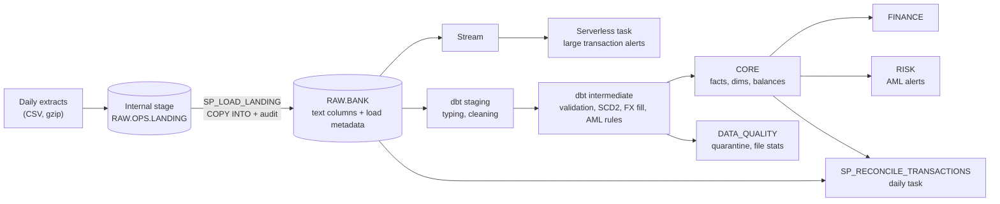

# Banking Data Platform on Snowflake and dbt

A data platform for retail bank transaction data, built on Snowflake and dbt with Python for ingestion, orchestration and validation. It takes messy daily core banking extracts, loads them into Snowflake, and builds tested facts, SCD type 2 dimensions, daily account balances, finance reporting and AML alerts.

Every dbt model also runs unchanged on DuckDB, so the full pipeline can be built and tested on a laptop or in CI without a Snowflake account.



## What it does

### Ingestion on Snowflake
* **Loading:**
  * Files land in an internal stage.
  * `COPY INTO` matches columns by header name and records the source file, row number and scan time on every row.
  * When a new column appears mid year, it loads without any code change.
* **Load procedure:** `SP_LOAD_LANDING` builds the COPY for one entity, writes one audit row per file, and returns a summary. COPY's own load history makes reruns skip files that were already loaded.
* **Realtime screening:** a stream on the raw transactions table feeds a serverless task, which checks only new rows for large transactions. The task is skipped at no cost when the stream is empty.
* **Reconciliation:** `SP_RECONCILE_TRANSACTIONS` recomputes daily counts and net amounts straight from RAW, using its own parsing. It compares them with the dbt fact table and fails if any day disagrees. A scheduled task runs it every morning.
* **Security:**
  * Four roles: admin, loader, transformer and analyst.
  * Managed access schemas and future grants.
  * A service user that uses key pair auth only.
  * A monthly resource monitor.
  * Optional masking policies for email and IBAN.

### Transformation in dbt
* **Staging:**
  * Raw data lands as text, so a bad value never breaks a load.
  * Staging handles two timestamp formats, decimal commas, casing and stray whitespace.
  * Rows that fail validation go to a quarantine table with a reason. Nothing is dropped silently.
* **`fct_transactions`:**
  * Incremental merge on `txn_id`; the latest delivered version of a transaction wins.
  * A 3 hour lookback catches loads that landed during the previous run.
  * Clustered by `txn_date` on Snowflake.
  * Amounts in both account currency and EUR. Weekend and holiday FX gaps carry the last published rate forward, and a test fails if a rate is more than 4 days stale.
* **`fct_account_daily_balance`:**
  * End of day balance for every account and day.
  * A late transaction changes every balance after it. Incremental runs therefore find the earliest affected date, take the balance from the day before, and rebuild forward from there. Cost scales with how late the data is, not with history.
* **`dim_customer`:**
  * SCD type 2, built from the customer change feed with window functions.
  * Changes that only reformat a value (an email in upper case, for example) are collapsed.
  * Reports join to it point in time: segment and risk rating as of month end, or as of the alert.
  * A dbt snapshot tracks account status separately.
* **AML rules, in SQL:**
  * Structuring: 3 or more cash deposits between 9,000 and 10,000 EUR within 24 hours.
  * Velocity: 10 or more card attempts within 60 minutes.
  * Amount outliers: a log scale z score against the account's previous 50 card payments.
  * Overlapping windows merge into one alert using a gaps and islands pattern.
* **Finance reports:**
  * A monthly customer summary: income, card spend, external flows, average and month end balance, and spend percentile within segment.
  * Merchant category spend net of reversed payments, with share of month and month over month growth.
* **Cross database:** macros dispatch timestamp parsing, regex and date functions per adapter, so the same models run on Snowflake and DuckDB.

### Testing and validation
* **dbt tests:**
  * 69 data tests: built in, custom generic and singular.
  * 5 unit tests: FX gap fill, SCD2 collapsing, the structuring window, the velocity window across midnight, and duplicate detection when a resent file is scanned before the original.
* **Singular tests** check that:
  * every delivered row ends up in exactly one place (the fact table or quarantine);
  * every account's final balance equals its opening balance plus posted movements;
  * reversals match their original payments.
* **Ground truth:** the generator records every problem it injects, and `bankdp validate` checks the pipeline caught each one.
* **Incremental check:** `bankdp run-local` loads data in two batches and runs dbt incrementally. It then rebuilds the incremental models from scratch and checks the results are identical, row for row.
* **pytest** covers generator determinism, loader idempotency, and that the Snowflake DDL matches the Python schema.

### Performance and cost
* **Benchmarks:** `snowflake/benchmarks/00_build_benchmark_tables.sql` scales the fact table to about 110M rows. `bankdp benchmark` then runs six experiments with the result cache off and a cold warehouse, reporting time, MB scanned, partitions pruned and estimated credits:
  * clustering;
  * a filter wrapped in a function, which defeats pruning;
  * search optimization for point lookups;
  * a triangular self join rewritten as a window function;
  * exact versus approximate distinct counts;
  * warehouse sizing.
* **Cost reporting:** every workload sets a query tag. `bankdp cost-report` reads `ACCOUNT_USAGE` and reports:
  * credits by warehouse and by workload;
  * the most expensive queries;
  * serverless task credits;
  * storage split into active, time travel and fail safe.
* **Join design:** the AML window rules join on (account, day bucket) with equality instead of a pure time range. Work grows with daily activity, not with account history.
* **Table types:** only `fct_transactions` is a permanent table, because it keeps time travel and fail safe. Everything else is transient and can be rebuilt, so it doesn't pay for fail safe storage.

## The data

A seeded generator produces one year of activity for a Dutch retail bank:
* 4,000 customers and 7,672 accounts.
* 2.81M transaction rows across 370 daily files.
* Card payments, salaries, rent, transfers, ATM withdrawals, cash deposits, fees, interest, reversals and declined payments.

It injects the problems real extracts have:

| Problem | Rows |
|---|---:|
| Transaction resent in the next day's file | 11,322 |
| Late arrival, 2 to 6 days after the transaction | 55,598 |
| Unparseable amount | 911 |
| Negative amount | 839 |
| Unknown account | 815 |
| Missing timestamp | 279 |
| Card payment with no merchant | 4,398 |
| Lowercase currency code | 28,147 |

It also includes three kinds of source change and gap:
* From day 180, the branch system switches to `DD/MM/YYYY` timestamps and decimal commas.
* A `device_id` column appears from day 121.
* FX rates are published on business days only.

It also plants 47 AML cases: 12 structuring, 15 velocity bursts and 20 amount outliers.

## Results on DuckDB

From `bankdp run-local` at full size (about 3 minutes on a 2 core machine). The output is in [docs/validation_report.md](docs/validation_report.md).

| Check | Expected | Actual | Result |
|---|---:|---:|---|
| Rejected as INVALID_AMOUNT | 911 | 911 | PASS |
| Rejected as NEGATIVE_AMOUNT | 839 | 839 | PASS |
| Rejected as UNKNOWN_ACCOUNT | 815 | 815 | PASS |
| Rejected as MISSING_TIMESTAMP | 279 | 279 | PASS |
| Duplicate rows detected | 11,322 | 11,322 | PASS |
| Late arrivals detected | 55,550 | 55,550 | PASS |
| Missing merchant warnings | 4,398 | 4,398 | PASS |
| Lowercase currency left after cleaning | 0 | 0 | PASS |

Late arrivals are 48 fewer than injected because 48 of those rows were also rejected, and rejected rows are not counted as late.

| AML rule | Injected cases | Detected | Recall | Alerts raised | Precision |
|---|---:|---:|---:|---:|---:|
| Structuring | 12 | 12 | 100% | 12 | 100% |
| Velocity | 15 | 15 | 100% | 15 | 100% |
| Outlier | 20 | 20 | 100% | 36 | 56% |

The outlier threshold came from a sweep over the full year of card payments:

| z threshold | Alerts | Injected cases caught | Precision |
|---:|---:|---:|---:|
| 4.0 | 80 | 20 | 25% |
| 4.5 | 59 | 20 | 34% |
| **5.0** | **36** | **20** | **56%** |
| 5.5 | 22 | 18 | 82% |
| 6.0 | 16 | 15 | 94% |

5.0 is the highest threshold that still catches every planted case. The 16 remaining alerts are genuinely unusual payments for their account, about one per 135,000 posted card payments.

After the second batch, incremental builds matched a full rebuild exactly:
* 2,799,511 transactions.
* 2,615,637 daily balances.
* 2,860 quarantined rows.

## Results on Snowflake

Run on a Snowflake Enterprise trial (AWS US West) with the same seeded data.

* **Loading:** 370 transaction files and 2,813,677 rows, with zero load errors. After the first batch, the row count for every entity matched the source files exactly.
* **dbt:** all 98 checks pass after both load batches. The second build merged only the new rows, and rebuilt balances forward from the earliest late date.
* **Reconciliation:** `SP_RECONCILE_TRANSACTIONS` checked RAW against the fact table for every day of the year, and all 365 days passed.
* **Validation:** every ground truth check and every AML result matches the DuckDB run exactly ([docs/validation_report_snowflake.md](docs/validation_report_snowflake.md)).

**A bug only Snowflake could show.** The first Snowflake validation counted 58,035 late arrivals instead of 55,550.
* **Cause:** the pipeline decided which delivery of a resent transaction came first by load time. Locally, every file in a batch shares one load time, so the file name breaks the tie. On Snowflake, each file in a COPY gets its own scan time, so a resent copy was sometimes stamped before the original and counted as late.
* **Why it mattered:** the same ordering picked the latest version of a transaction, so a real correction could have kept the old version.
* **Fix:** deliveries are now ordered by the extract date in the file name. A unit test reproduces the Snowflake case.

### Performance

Measured on 111,980,440 rows on an XSMALL warehouse, with the result cache off. Full output is in [docs/benchmark_results.md](docs/benchmark_results.md).

| Experiment | Before | After | Change |
|---|---|---|---|
| Running balance for a year: self join, then window function | 83.3 s | 2.5 s | 34x faster |
| Monthly report: filter with `to_char(txn_date)`, then a date range | 3.32 s, 72 of 74 partitions | 0.22 s, 1 of 74 partitions | 15x faster |
| Monthly report: unclustered, then clustered on `txn_date` | 48 of 48 partitions | 1 of 74 partitions | 98% of partitions pruned |
| Monthly active accounts: exact, then approximate distinct | 2.16 s | 1.45 s | 33% faster |
| Lookup by transaction id: no index, then search optimization | 0.57 s | 0.39 s | 32% faster |

Warehouse sizing on a full history scan:

| Warehouse | Warm time | Cost per run (credits) |
|---|---:|---:|
| XSMALL | 1.51 s | 0.00042 |
| SMALL | 1.10 s | 0.00061 |
| MEDIUM | 0.95 s | 0.00106 |

Doubling the warehouse did not halve the time. 112M rows compress into only 48 micro partitions, which is too little work to spread across more nodes. MEDIUM cost 2.5 times as much as XSMALL for a 1.6 times speedup, so XSMALL is the right size for this workload.

On tables this size, timings move by a few tenths of a second between runs. Partition counts are exact. Search optimization shows only a small gain because there are few partitions to skip; it pays off on much larger tables.

## Run it locally

```bash
python3.12 -m venv .venv && source .venv/bin/activate    # Python 3.10 to 3.13
pip install -e ".[dev]"
bankdp run-local                        # generate, load, build, check incremental, validate
```

Then explore the results:
* `duckdb warehouse/bank.duckdb` to query the tables.
* `cd dbt && dbt docs generate && dbt docs serve` for lineage and model docs. Set `DBT_PROFILES_DIR=.` first.

`bankdp run-local --customers 800 --days 120` builds a smaller dataset in under a minute.

## Run it on Snowflake

See [docs/snowflake_runbook.md](docs/snowflake_runbook.md). The short version:
1. Run the numbered scripts in `snowflake/`.
2. Set up key pair auth.
3. Run `bankdp load-snowflake`.
4. Run `dbt build --target prod`.
5. Run `bankdp validate --target snowflake`.

## Layout

```
snowflake/            setup scripts: roles, warehouses, raw layer, procedures, streams, tasks, grants, masking
snowflake/benchmarks/ 110M row benchmark tables
src/bankdp/           generator, loaders, CLI, validation, benchmark and cost report
dbt/models/staging/       typed views over raw
dbt/models/intermediate/  validation, SCD2 history, FX calendar, AML rule hits
dbt/models/marts/         core, finance, risk, data_quality
dbt/tests/                singular tests
dbt/macros/               cross database helpers, generic tests, Snowflake features
tests/                pytest
```

## Design notes

* **Text in, types later.** RAW stores every column as text, so a bad value never fails a load. Typing and rejection happen in dbt, where they're tested and visible in the quarantine table.
* **Latest version wins.** Merging on `txn_id` means a corrected transaction replaces the earlier one. Incremental runs and a full rebuild give the same answer, and `run-local` checks that on every run.
* **Separate history paths.** Customer SCD2 comes from the source's own change history, so it's complete even for changes made between runs. The account snapshot shows the other approach, dbt capturing state at run time.
* **An independent control.** The reconciliation procedure doesn't reuse dbt's logic, so a bug in one side shows up as a mismatch.
* **Limits.**
  * The data is synthetic.
  * The AML rules show the SQL patterns involved; they are not a compliance system.
  * The realtime alert compares amounts in account currency, because FX conversion happens downstream in dbt.
